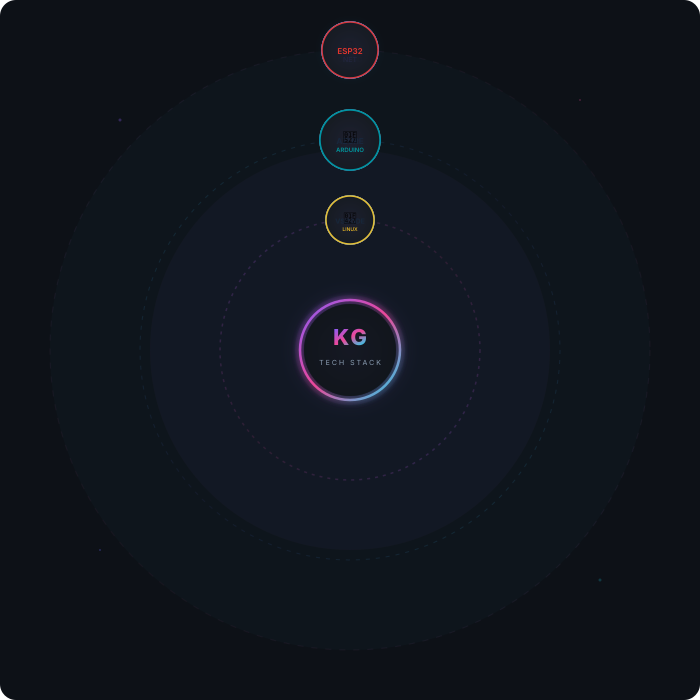
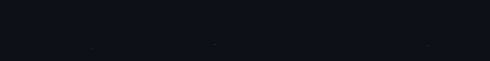
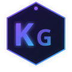

<!-- ╔══════════════════════════════════════════════════════════════════════╗
     ║                                                                      ║
     ║                  K A V I N   G  —  G I T H U B  P O R T F O L I O   ║
     ║                                                                      ║
     ║                    Premium Developer Profile · 2026                  ║
     ║                                                                      ║
     ║    Design: Dark Aurora · Neon Accents · Apple-Inspired Minimalism    ║
     ║    Palette: #8B5CF6 · #EC4899 · #22D3EE · #6366F1 · #0D1117        ║
     ║                                                                      ║
     ╚══════════════════════════════════════════════════════════════════════╝ -->


<!-- ━━━━━━━━━━━━━━━━━━━━━━━━━━━━━━━━━━━━━━━━━━━━━━━━━━━━━━━━━━━━━━━━━━━━
     SECTION 1 — HERO BANNER
     Custom aurora SVG with particles, gradient mesh, and light rays
     ━━━━━━━━━━━━━━━━━━━━━━━━━━━━━━━━━━━━━━━━━━━━━━━━━━━━━━━━━━━━━━━━━━━━ -->

<div align="center">
  
</div>

<br>

<!-- ━━━━━━━━━━━━━━━━━━━━━━━━━━━━━━━━━━━━━━━━━━━━━━━━━━━━━━━━━━━━━━━━━━━━
     DIVIDER 1 — Aurora
     ━━━━━━━━━━━━━━━━━━━━━━━━━━━━━━━━━━━━━━━━━━━━━━━━━━━━━━━━━━━━━━━━━━━━ -->

<div align="center">
  
</div>

<br>

<!-- ━━━━━━━━━━━━━━━━━━━━━━━━━━━━━━━━━━━━━━━━━━━━━━━━━━━━━━━━━━━━━━━━━━━━
     SECTION 2 — DEVELOPER ID BADGE
     Hanging badge with lanyard, metal clip, avatar, barcode
     ━━━━━━━━━━━━━━━━━━━━━━━━━━━━━━━━━━━━━━━━━━━━━━━━━━━━━━━━━━━━━━━━━━━━ -->

<div align="center">
  
</div>

<br>

<!-- ━━━━━━━━━━━━━━━━━━━━━━━━━━━━━━━━━━━━━━━━━━━━━━━━━━━━━━━━━━━━━━━━━━━━
     SECTION 3 — DYNAMIC TYPING ANIMATION
     Rotating roles using readme-typing-svg
     ━━━━━━━━━━━━━━━━━━━━━━━━━━━━━━━━━━━━━━━━━━━━━━━━━━━━━━━━━━━━━━━━━━━━ -->

<div align="center">
  <a href="https://github.com/Kavin2533">
    
  </a>
</div>

<br>

<!-- ━━━━━━━━━━━━━━━━━━━━━━━━━━━━━━━━━━━━━━━━━━━━━━━━━━━━━━━━━━━━━━━━━━━━
     SECTION 4 — RECRUITER-FRIENDLY ABOUT ME
     Professional summary, objectives, highlights, and quick facts
     ━━━━━━━━━━━━━━━━━━━━━━━━━━━━━━━━━━━━━━━━━━━━━━━━━━━━━━━━━━━━━━━━━━━━ -->

<div align="center">
  
</div>

<br>

<div align="center">

```
╔══════════════════════════════════════════════════════════╗
║                    PROFESSIONAL PROFILE                  ║
╚══════════════════════════════════════════════════════════╝
```

</div>

<table align="center">
<tr>
<td width="50%" valign="top">

### 🧑‍💻 Professional Summary

Passionate and detail-oriented **Software Engineer** and **Electronics & Communication Engineering** student from **Tamil Nadu, India**. I bring a unique blend of software development expertise, cloud computing knowledge, and networking fundamentals. Experienced in building full-stack applications with **Java** and **Python**, deploying cloud solutions on **Azure**, and configuring enterprise networks using **Cisco** technologies.

### 🎯 Career Objective

Seeking opportunities to leverage my diverse technical skills in **software engineering**, **cloud infrastructure**, and **network engineering** to build impactful, scalable solutions. Eager to contribute to innovative teams while continuously growing as a professional.

### 🔭 Current Focus

- 🏗️ Building production-grade applications with **Java** & **Python**
- ☁️ Expanding **Azure** cloud architecture skills
- 🌐 Mastering **enterprise networking** with Cisco
- 🤖 Exploring **AI & IoT** integration projects
- 📖 Contributing to **open-source** communities

</td>
<td width="50%" valign="top">

### 💼 What I'm Looking For

- 🚀 **Internships** in Software Engineering or Cloud Computing
- 🤝 **Collaborative** open-source projects
- 🧠 **Mentorship** from industry professionals
- 🌍 **Remote-friendly** opportunities

### 💡 Core Strengths

| Strength | Description |
|:---:|---|
| 🧠 | **Analytical Thinking** — Strong problem-solving mindset |
| 🔧 | **Full-Stack Development** — End-to-end application building |
| ☁️ | **Cloud Computing** — Azure certified professional |
| 🌐 | **Networking** — Cisco CCNA certified |
| 🤖 | **Hardware Integration** — Arduino & ESP32 projects |
| 📚 | **Continuous Learning** — Always exploring new technologies |

### 🎓 Education

**B.E. Electronics & Communication Engineering**
📍 Tamil Nadu, India

### 📅 Availability

✅ **Open to internships & entry-level positions**
🌏 Open to remote & on-site (India)

</td>
</tr>
</table>

<br>

<!-- Quick Highlights -->
<div align="center">

| 🔭 Currently Building | 🌱 Learning | 🎯 Goal | 📍 Location |
|:---:|:---:|:---:|:---:|
| Power Loom Management System | Azure Cloud & Networking | Cloud-Native Engineer | Tamil Nadu, India |

</div>

<br>

<!-- Resume & Contact Quick Actions -->
<div align="center">
  <a href="mailto:kavin2311g@gmail.com">
    
  </a>
  &nbsp;
  <a href="https://github.com/Kavin2533">
    
  </a>
  &nbsp;
  <a href="https://linkedin.com/in/kavin-g-9ba6b32a1">
    
  </a>
</div>

<br>

<!-- ━━━━━━━━━━━━━━━━━━━━━━━━━━━━━━━━━━━━━━━━━━━━━━━━━━━━━━━━━━━━━━━━━━━━
     SECTION 5 — SOCIAL LINKS
     Premium badge buttons for all platforms
     ━━━━━━━━━━━━━━━━━━━━━━━━━━━━━━━━━━━━━━━━━━━━━━━━━━━━━━━━━━━━━━━━━━━━ -->

<div align="center">
  
</div>

<br>

<div align="center">
  <a href="https://github.com/Kavin2533">
    
  </a>
  &nbsp;
  <a href="https://linkedin.com/in/kavin-g-9ba6b32a1">
    
  </a>
  &nbsp;
  <a href="mailto:kavin2311g@gmail.com">
    
  </a>
  &nbsp;
  <a href="https://github.com/Kavin2533">
    
  </a>
</div>

<br><br>

<!-- ━━━━━━━━━━━━━━━━━━━━━━━━━━━━━━━━━━━━━━━━━━━━━━━━━━━━━━━━━━━━━━━━━━━━
     DIVIDER 2 — Liquid
     ━━━━━━━━━━━━━━━━━━━━━━━━━━━━━━━━━━━━━━━━━━━━━━━━━━━━━━━━━━━━━━━━━━━━ -->

<div align="center">
  
</div>

<br>

<!-- ━━━━━━━━━━━━━━━━━━━━━━━━━━━━━━━━━━━━━━━━━━━━━━━━━━━━━━━━━━━━━━━━━━━━
     SECTION 6 — ANIMATED TECH ORBIT
     Custom SVG with orbiting technology icons
     ━━━━━━━━━━━━━━━━━━━━━━━━━━━━━━━━━━━━━━━━━━━━━━━━━━━━━━━━━━━━━━━━━━━━ -->

<div align="center">
  
</div>

<br>

<div align="center">
  
</div>

<br>

<!-- ━━━━━━━━━━━━━━━━━━━━━━━━━━━━━━━━━━━━━━━━━━━━━━━━━━━━━━━━━━━━━━━━━━━━
     SECTION 7 — FEATURED SKILLS
     Organized by category with icons and descriptions
     ━━━━━━━━━━━━━━━━━━━━━━━━━━━━━━━━━━━━━━━━━━━━━━━━━━━━━━━━━━━━━━━━━━━━ -->

<div align="center">
  
</div>

<br>

<!-- All skill icons in one strip -->
<div align="center">
  
</div>

<br>

<!-- Detailed skill categories -->
<table align="center">

<tr>
<td align="center" width="20%">

**💻 Programming**

<br>


<br><br>


<br>

<sub>Core languages for<br>full-stack development</sub>

</td>
<td align="center" width="20%">

**☁️ Cloud**

<br>


<br><br>


<br>

<sub>Azure certified cloud<br>professional</sub>

</td>
<td align="center" width="20%">

**🌐 Networking**

<br>


<br><br>


<br>

<sub>Enterprise networking<br>& Cisco certified</sub>

</td>
<td align="center" width="20%">

**🔧 Hardware**

<br>


<br><br>


<br>

<sub>Embedded systems &<br>IoT development</sub>

</td>
<td align="center" width="20%">

**🛠️ Tools**

<br>


<br><br>


<br>

<sub>Dev tools & version<br>control ecosystem</sub>

</td>
</tr>

</table>

<br>

<!-- Frameworks row -->
<div align="center">
  
  &nbsp;
  
  &nbsp;
  
</div>

<br><br>

<!-- ━━━━━━━━━━━━━━━━━━━━━━━━━━━━━━━━━━━━━━━━━━━━━━━━━━━━━━━━━━━━━━━━━━━━
     DIVIDER 3 — Gradient
     ━━━━━━━━━━━━━━━━━━━━━━━━━━━━━━━━━━━━━━━━━━━━━━━━━━━━━━━━━━━━━━━━━━━━ -->

<div align="center">
  
</div>

<br>

<!-- ━━━━━━━━━━━━━━━━━━━━━━━━━━━━━━━━━━━━━━━━━━━━━━━━━━━━━━━━━━━━━━━━━━━━
     SECTION 8 — LIVE DEVELOPER DASHBOARD
     GitHub Stats, Top Languages, Streak, Trophy
     ━━━━━━━━━━━━━━━━━━━━━━━━━━━━━━━━━━━━━━━━━━━━━━━━━━━━━━━━━━━━━━━━━━━━ -->

<div align="center">
  
</div>

<br>

<!-- Stats & Languages side by side -->
<div align="center">
  <a href="https://github.com/Kavin2533">
    
  </a>
  &nbsp;&nbsp;
  <a href="https://github.com/Kavin2533">
    
  </a>
</div>

<br>

<!-- GitHub Streak -->
<div align="center">
  <a href="https://github.com/Kavin2533">
    
  </a>
</div>

<br>

<!-- GitHub Trophy -->
<div align="center">
  <a href="https://github.com/Kavin2533">
    
  </a>
</div>

<br>

<!-- Quick metrics badges -->
<div align="center">
  
  &nbsp;
  
  &nbsp;
  
</div>

<br><br>

<!-- ━━━━━━━━━━━━━━━━━━━━━━━━━━━━━━━━━━━━━━━━━━━━━━━━━━━━━━━━━━━━━━━━━━━━
     SECTION 9 — CONTRIBUTION ANALYTICS
     Activity Graph, Snake Animation, Metrics
     ━━━━━━━━━━━━━━━━━━━━━━━━━━━━━━━━━━━━━━━━━━━━━━━━━━━━━━━━━━━━━━━━━━━━ -->

<div align="center">
  
</div>

<br>

<!-- Activity Graph -->
<div align="center">
  <a href="https://github.com/Kavin2533">
    
  </a>
</div>

<br>

<!-- Snake Animation — requires GitHub Actions workflow to run once; see docs/setup.md -->
<div align="center">
  
</div>

<br><br>

<!-- ━━━━━━━━━━━━━━━━━━━━━━━━━━━━━━━━━━━━━━━━━━━━━━━━━━━━━━━━━━━━━━━━━━━━
     DIVIDER 4 — Glass
     ━━━━━━━━━━━━━━━━━━━━━━━━━━━━━━━━━━━━━━━━━━━━━━━━━━━━━━━━━━━━━━━━━━━━ -->

<div align="center">
  
</div>

<br>

<!-- ━━━━━━━━━━━━━━━━━━━━━━━━━━━━━━━━━━━━━━━━━━━━━━━━━━━━━━━━━━━━━━━━━━━━
     SECTION 10 — FEATURED PROJECTS
     Three showcase project cards
     ━━━━━━━━━━━━━━━━━━━━━━━━━━━━━━━━━━━━━━━━━━━━━━━━━━━━━━━━━━━━━━━━━━━━ -->

<div align="center">
  
</div>

<br>

<!-- Project 1: Power Loom Management System -->
<table align="center">
<tr>
<td width="50%" valign="top">

<div align="center">

### 🏭 Power Loom Management System

<br>


</div>

<br>

A comprehensive management system designed for the **textile industry** to streamline power loom operations. Features inventory tracking, production monitoring, order management, employee management, and real-time analytics for loom performance.

<br>

**Tech Stack:**


<br>

<div align="center">
  <a href="https://github.com/Kavin2533">
    
  </a>
</div>

</td>
<td width="50%" valign="top">

<div align="center">

### 💰 Expense Tracker

<br>


</div>

<br>

A smart **expense tracking application** that helps users manage their finances effectively. Features include expense categorization, budget planning, visual analytics with charts, monthly/weekly summaries, and data export functionality.

<br>

**Tech Stack:**


<br>

<div align="center">
  <a href="https://github.com/Kavin2533">
    
  </a>
</div>

</td>
</tr>
</table>

<br>

<!-- Project 3: Footstep Power Generator -->
<table align="center">
<tr>
<td width="70%" valign="top">

<div align="center">

### ⚡ Footstep Power Generator

<br>


</div>

<br>

An innovative **IoT-based energy harvesting** project that converts kinetic energy from footsteps into electrical power. Uses piezoelectric sensors connected to **Arduino/ESP32** microcontrollers to capture, store, and monitor energy generation in real-time. Ideal for sustainable energy solutions in high-footfall areas.

<br>

**Tech Stack:**


<br>

<div align="center">
  <a href="https://github.com/Kavin2533">
    
  </a>
</div>

</td>
</tr>
</table>

<br><br>

<!-- ━━━━━━━━━━━━━━━━━━━━━━━━━━━━━━━━━━━━━━━━━━━━━━━━━━━━━━━━━━━━━━━━━━━━
     SECTION 11 — CERTIFICATIONS
     Premium certificate cards
     ━━━━━━━━━━━━━━━━━━━━━━━━━━━━━━━━━━━━━━━━━━━━━━━━━━━━━━━━━━━━━━━━━━━━ -->

<div align="center">
  
</div>

<br>

<div align="center">

| 🏅 Certification | 🏢 Provider | ✅ Status |
|:---|:---:|:---:|
| **Microsoft Azure Fundamentals** (AZ-900) |  |  |
| **Cisco Certified Network Associate** (CCNA) |  |  |
| **Java Programming** |  |  |
| **NPTEL Industry 4.0** |  |  |
| **Python Workshop** |  |  |

</div>

<br>

<!-- Certification highlight badges -->
<div align="center">
  
  &nbsp;
  
  &nbsp;
  
</div>

<br><br>

<!-- ━━━━━━━━━━━━━━━━━━━━━━━━━━━━━━━━━━━━━━━━━━━━━━━━━━━━━━━━━━━━━━━━━━━━
     DIVIDER 5 — Neon
     ━━━━━━━━━━━━━━━━━━━━━━━━━━━━━━━━━━━━━━━━━━━━━━━━━━━━━━━━━━━━━━━━━━━━ -->

<div align="center">
  
</div>

<br>

<!-- ━━━━━━━━━━━━━━━━━━━━━━━━━━━━━━━━━━━━━━━━━━━━━━━━━━━━━━━━━━━━━━━━━━━━
     SECTION 12 — LET'S CONNECT
     Final call-to-action with professional buttons
     ━━━━━━━━━━━━━━━━━━━━━━━━━━━━━━━━━━━━━━━━━━━━━━━━━━━━━━━━━━━━━━━━━━━━ -->

<div align="center">
  
</div>

<br>

<div align="center">

```
╔══════════════════════════════════════════════════════════════╗
║                                                              ║
║     I'm always excited to collaborate on interesting         ║
║     projects, discuss new technologies, or explore           ║
║     opportunities. Let's build something amazing together!   ║
║                                                              ║
╚══════════════════════════════════════════════════════════════╝
```

</div>

<br>

<div align="center">
  <a href="https://github.com/Kavin2533">
    
  </a>
  &nbsp;&nbsp;
  <a href="https://linkedin.com/in/kavin-g-9ba6b32a1">
    
  </a>
  &nbsp;&nbsp;
  <a href="mailto:kavin2311g@gmail.com">
    
  </a>
</div>

<br><br>

<!-- ━━━━━━━━━━━━━━━━━━━━━━━━━━━━━━━━━━━━━━━━━━━━━━━━━━━━━━━━━━━━━━━━━━━━
     SECTION 13 — PREMIUM FOOTER
     Custom footer SVG with aurora gradient
     ━━━━━━━━━━━━━━━━━━━━━━━━━━━━━━━━━━━━━━━━━━━━━━━━━━━━━━━━━━━━━━━━━━━━ -->

<div align="center">
  
</div>

<br>

<div align="center">
  
  <br><br>
  <samp>Made with ❤️ by <b>Kavin G</b></samp>
  <br><br>
  
  <br><br>
  <sub>© 2026 Kavin G · All Rights Reserved</sub>
  <br>
  <sub>⭐ Star this repository if you find it inspiring!</sub>
</div>

<br>

<!-- ━━━━━━━━━━━━━━━━━━━━━━━━━━━━━━━━━━━━━━━━━━━━━━━━━━━━━━━━━━━━━━━━━━━━
     END OF README
     
     Repository: github.com/Kavin2533/Kavin2533
     Design: Dark Aurora Theme · Premium Portfolio
     ━━━━━━━━━━━━━━━━━━━━━━━━━━━━━━━━━━━━━━━━━━━━━━━━━━━━━━━━━━━━━━━━━━━━ -->
